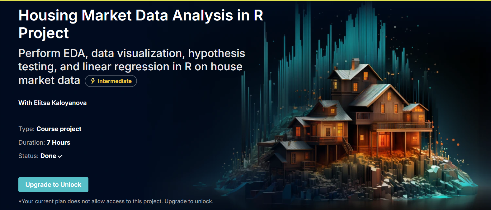

# Housing-Market
This project explores a dataset related to housing prices. The goal is to perform various analyses, including summary statistics, hypothesis testing, and prediction using linear regression.
[365DataScience](https://learn.365datascience.com/projects/housing-market-data-analysis-in-r-project/?tab=description)



## I- Data Analysis
### 1. Load the data
Read data from te csv file
To begin, read the dataset from the CSV file:

```
data <- read.csv("housing_data.csv")
head(data, 5)
```
### 2. Summary statistics
The next step is to generate summary statistics for the dataset. This can include the minimum, maximum, mean, and other descriptive statistics
### 3. Calculate mean, mode and median, as well as the standard deviation for each variable
For each variable, calculate the mean, median and standard deviation

```
#means
means <- function(df, column) {
    mean_value <- mean(df[[column]], na.rm = TRUE)
    return(mean_value)
}

for (col in colnames(data)) {
    cat(paste("Mean of", col, ":", means(data, col), "\n"))
}
#modes
mode <- function(df, column) {
    unique <- unique(df[[column]])
    mode_value <- unique[which.max(tabulate(match(df[[column]], unique)))]
    return(mode_value)
}

for (col in colnames(data)) {
    cat(paste("Mode of", col, ":", mode(data, col), "\n"))
}
#median
median_value <- function(df, column) {
  med <- median(df[[column]], na.rm = TRUE)
  return(med)
}

for (col in colnames(data)) {
  cat(paste("Median of", col, ":", median_value(data, col), "\n"))
}

#standard deviation
sd_average_rooms <- sd(data$Average.Rooms, na.rm = TRUE)
sd_crime_rate <- sd(data$Crime.Rate, na.rm = TRUE)
sd_transport_access <- sd(data$Public.Transport.Access, na.rm = TRUE)
sd_schools <- sd(data$Number.of.Schools, na.rm = TRUE)
sd_home_value <- sd(data$Median.Home.Value, na.rm = TRUE)
print(sd_average_rooms)
print(sd_crime_rate)
print(sd_transport_access)
print(sd_schools)
print(sd_home_value)

```


### 4. Compute the correlation between each pair of variables

Correlation analysis helps in understanding the relationships between variables. Use the cor() function to compute pairwise correlations:
```
cor_matrix <- cor(data)
print(cor_matrix)

```
This will display a histogram of the Median.Home.Value with 8 bins (adjust binwidth as needed).

## II- Data visualization
### Create a histogram of house prices with styling and 8 bins
A histogram helps visualize the distribution of house prices. Below is the code to generate a histogram of house prices:
```
ggplot(data, aes(x = Median.Home.Value)) +
  geom_histogram(binwidth = 100000, color = "black", fill = "blue", alpha = 0.7) +
  labs(title = "Distribution of House Prices", x = "Median Home Value", y = "Frequency") +
  theme_minimal()
```
## III- Hypothesis testing:

We will now determine if there's a statistically significant difference in the median home values of areas with high crime rates compared to areas with low crime rates.
- **Null Hypothesis (H0​):** The median home values are the same for areas with high and low crime rates.
- **Alternative Hypothesis (H1​):** The median home values differ for areas with high crime rates compared to areas with low crime rates.

  ```
  t_test_result <- t.test(Median.Home.Value ~ Crime.Category, data = data_cleaned, var.equal = TRUE)
  t_test_result
  ```
  P-Value is 0.2209, which is greater than 0.05 so we **fail to reject** the null hypothesis and conclude that there is no significant difference
## IV- Prediction with linear regression
In this final part, a linear regression model is built to predict Median.Home.Value based on Average.Rooms, we can visualize it directly by using:
```
ggplot(data, aes(x = Average.Rooms, y = Median.Home.Value)) +
  geom_point() +
  geom_smooth(method = "lm", col = "red") +
  labs(title = "Regression of Median Home Value on Average Rooms",
       x = "Average Rooms",
       y = "Median Home Value")
```

## V- Conclusion
In this project, we have performed exploratory data analysis, hypothesis testing, and built a prediction model using linear regression. These analyses provide insights into the housing market and how certain variables, such as the number of rooms, influence home prices.

# Demo:
Link to the demo: [Youtube](https://youtu.be/DDIv-JADZmc)
